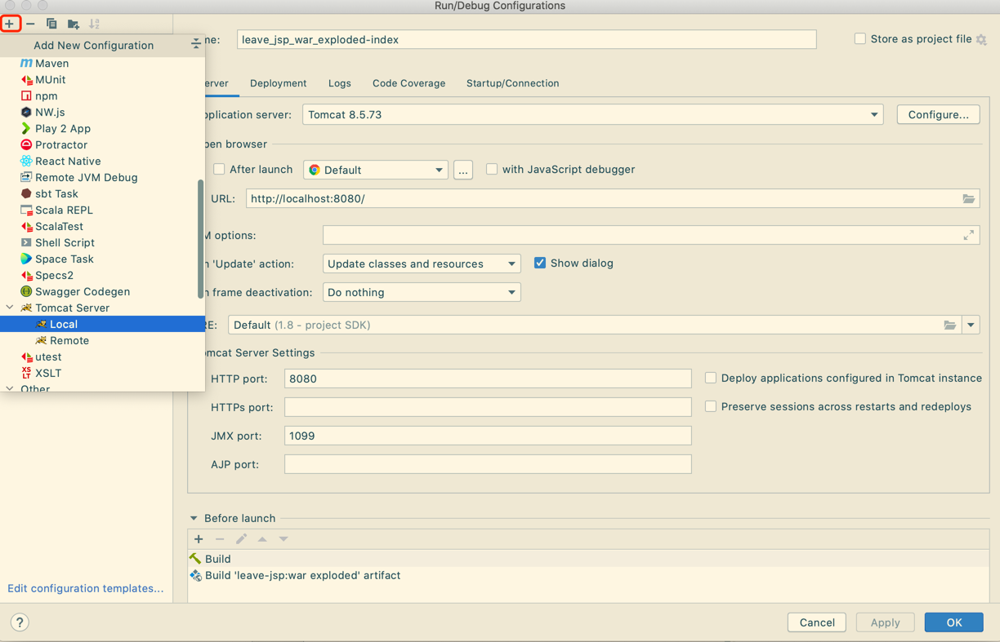
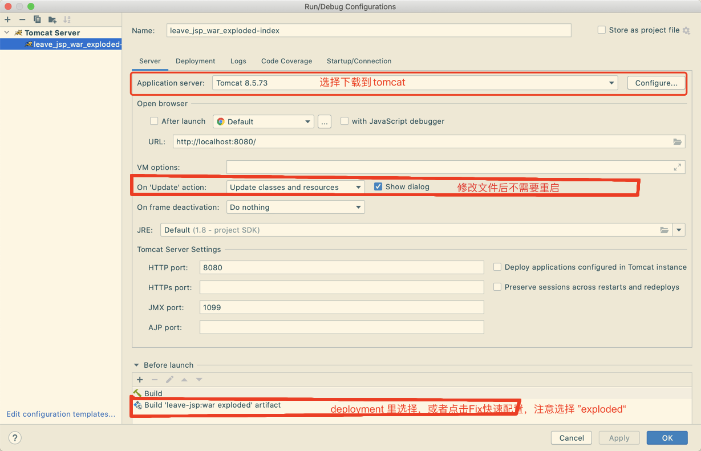

# 开发环境配置

## 前置依赖

- Java8
- Tomcat8
- IntelliJ IDEA（with tomcat plugin）
## 开发配置
1. 用 IDEA 导入项目
2. 配置启动
   1. 点击 "Run" -> "Edit Configurations...",弹出 新窗口“Run/Debug Configuration”
   2. Add New Configuration 点击 “+”，选择 “Tomcat Server” -> "Local"
   
   3. 配置 Server -> Application Server
   4. 点击Fix(配置 Deployment -> Add)， 选择 "Artifact leave-jsp:war exploded"
   5. 修改Application Context 为 “/”

3. 启动项目
4. 在浏览器输入地址 http://localhost:8080/ ，可以看到index页面。

## 常见问题

#### 1. 修改文件后页面不刷新
重启服务
#### 2. 在 IDEA 中配置 tomcat
1. 下载 https://tomcat.apache.org/download-80.cgi
2. 